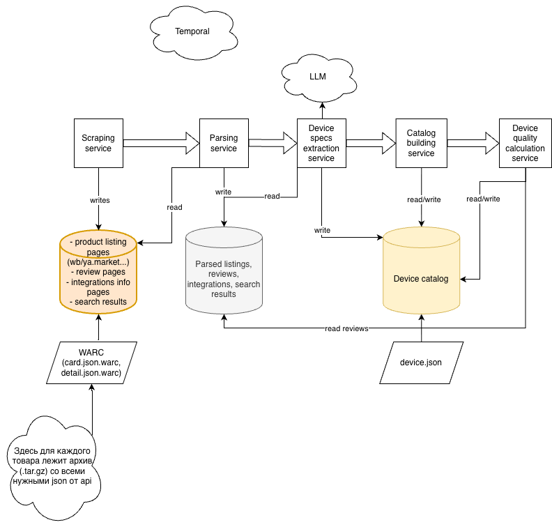

# БД каталога устройств

Здесь хранится итоговый каталог устройств, данные о совместимости устройств с экосистемами, данные о страницах с листингами товаров устройств на маркетплейсах.

Таблицы здесь заполняются пайплайном данных построения каталога. 

## Миграции

Стандартный нейминг:
- xxxxxx_{migration_name}.up.sql - up-миграция
- xxxxxx_{migration_name}.down.sql - down-миграция

Чтобы добавить что-то в схему БД, надо создать новую up и соответствующую down миграцию.  

Для применения миграций можно использовать, например, [migrate](https://github.com/golang-migrate/migrate)

## Структура

Нейминг бронза-серебро-золото взят из [databricks](https://web.archive.org/web/20260205065022/https://www.databricks.com/glossary/medallion-architecture)

- Бронза: сырые данные с веб-страниц и api маркетплейсов (html/json)
- Серебро: первичный парсинг сырых данных. Здесь данные приведены к общей схеме.
- Золото: итоговый каталог устройств + данные о совместимости. Здесь данные об одном устройстве сведены в одну запись (дедупликация), произведен более детальный парсинг.

Одно устройство в каталоге связано с 1+ листингами товаров на маркетплейсах - листинги могут отличаться по цене, количеству устройств, url

### Бронзовый слой

#### tracked_pages
страницы/ресурсы, которые мы трекаем в рамках скрейпинга.
- листинг товара - url на [листинг в wildberries](https://www.wildberries.ru/catalog/163876717/detail.aspx?targetUrl=EX)
- страница с данными о совместимости (например [страница поддерживаемых zigbee устройств](https://alice.yandex.ru/support/ru/smart-home/supported-zigbee-devices))
- поиск листингов товаров определенной категории - специальный тип с page_type = discovery. У таких "страниц" url может быть, например, wildberries://discovery/smart_lamp - далее скрейпер для wildberries сможет распарсить этот url и решить, как найти все результаты поиска для умных лампочек

#### page_snapshots
Результат скачивания всех нужных ресурсов для определенной страницы в определенное время.  
У каждого листинга товара есть определенные ресурсы (html, json), которые мы хотим скачать и сохранить, чтобы потом разобрать на поля. 
Например:
- detail.json (получаем по api) - здесь рейтинг и цена товара
- card.json - здесь описание товара

Для страницы с типом discovery ресурсы были бы что-то вроде: search_results_page_1.json, search_results_page_2.json, search_results_page_3.json, ...

Каждый ресурс пишем в формате [WARC](https://en.wikipedia.org/wiki/WARC_(file_format)) и все пакуем в архив .tar.gz (поле warc_bundle_archive)

### Серебряный слой

#### parsed_listing_snapshots

Первичный парсинг снепшота страницы товара (имя, бренд, цена, количество устройств, рейтинг...).  
Связан 1-1 с page_snapshots.  

### Золотой слой

#### llm_extracted_listings
Данные о листинге товара, но с определенной категорией устройства (smart_lamp, motion_sensor, ...) и характеристиками.

В device_attributes лежит json с характеристиками устройства. Схема соответствует схеме для этого типа устройств из таксономии, но немного преобразованной: все поля required, при этом nullable. Это нужно, чтобы для каждого поля мы понимали явно, нашлось значение для него или нет (null).

В taxonomy_version лежит git tag с версией таксономией, которая использовалась для схемы.  

#### device

Здесь информация о конкретном устройстве умного дома, с дедупликацией - можно считать, что одинаковых устройств (одна и та же модель, но разные строки в таблице) здесь не может быть. 

В device_attributes лежит json, соответствующий схеме из таксономии. 

#### listing_device_links

Связи llm_extracted_listing с device - каждое устройство получается из 1+ листингов.  

#### direct_compatibility

Прямая совместимость устройств (brand+model) с экосистемами.  
Пример: "aqara", "WSDCGQ11LM" -> "yandex"

#### bridge_ecosystem_compatibility

Совместимость устройств с экосистемами через стороннюю экосистему по определенному протоколу.  

Пример:  
"aqara" "FP300", source="aqara", target="apple", protocol="matter-over-thread"  
Датчик присутствия [Aqara FP300](https://www.aqara.com/en/product/presence-multi-sensor-fp300/) можно пробросить в Apple Home, если:
- Есть Aqara hub с поддержкой zigbee и matter-over-thread  
- Есть Apple hub с поддержкой matter-over-thread  
([больше информации](https://www.aqara.com/en/explore/everything-matter/))

Пример 2  
Aqara Roller Shade Driver E1, source=aqara, target=yandex, protocol=cloud  

Этот мотор для штор можно пробросить в умной дом яндекса, если подключили его в aqara home через aqara hub - больше ничего не нужно, потому что это облачная интеграция, протокол cloud

## Схема пайплайна данных

