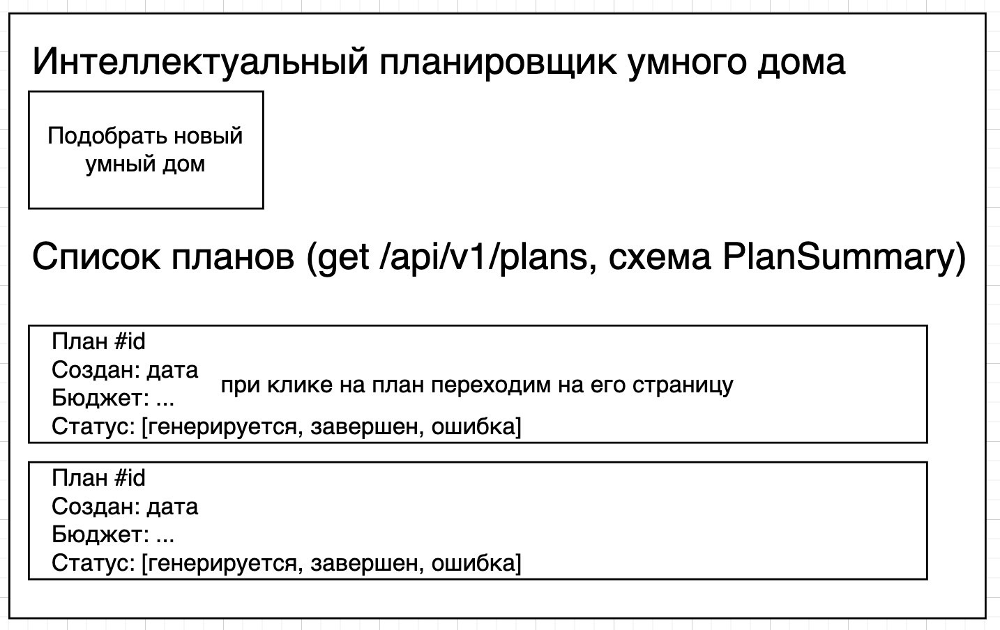
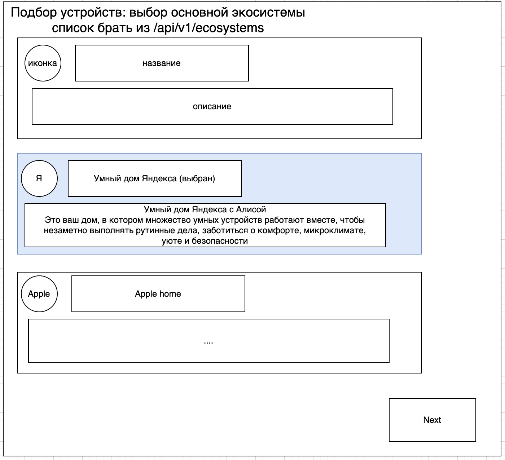
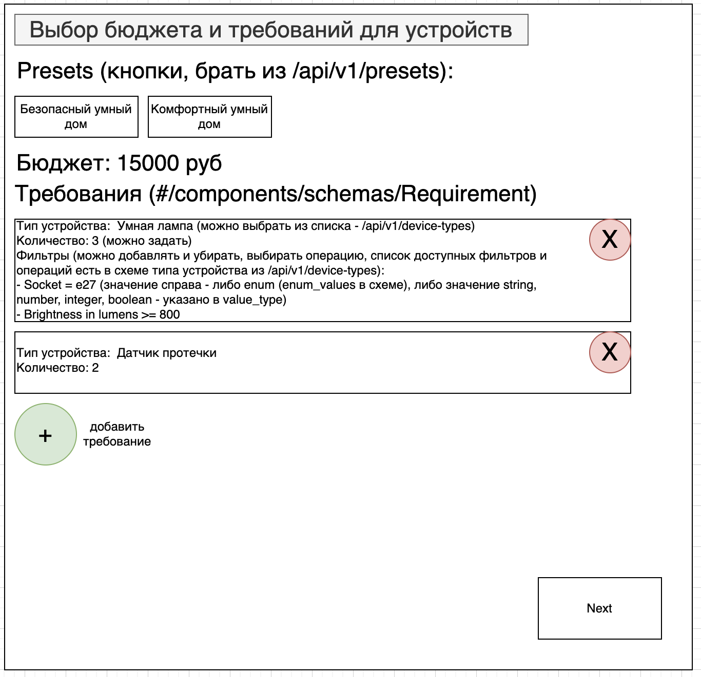
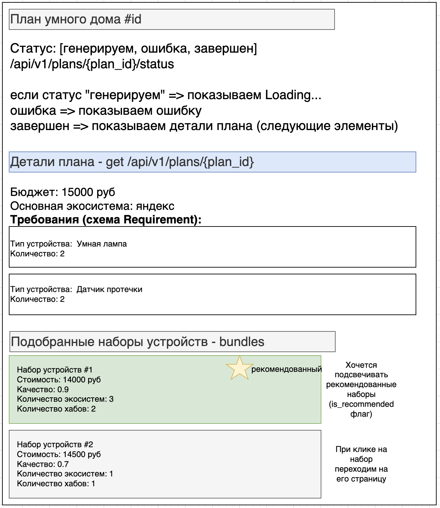
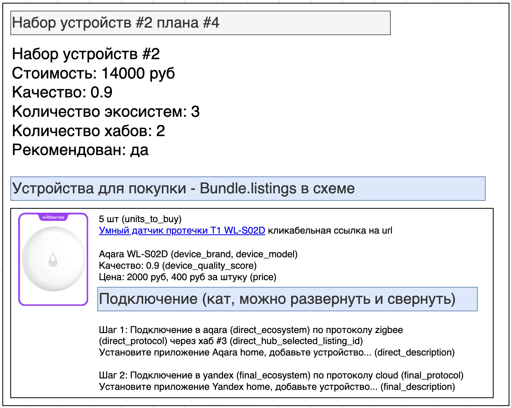

# Фронтенд для подбора устройств

Цель здесь - сделать минимальный фронт, чтобы можно было смотреть и создавать планы умного дома.  
Требования (сколько нужно каких устройств) задаются пока вручную.  

API: [openapi.yaml](openapi.yaml)

# Макеты для страниц

## Главная страница

Главная страница планировщика.  
При клике на "подобрать новый умный дом" переходим на страницу выбора основной экосистемы.  
Показывается список планов умного дома - берем из GET /api/v1/plans, у каждого плана схема PlanSummary. При клике на план переходим на его страницу.  

## Планирование умного дома: шаг 1, выбор основной экосистемы

Здесь выбираем основную экосистему для умного дома (яндекс, apple, ...) - показывается список с иконкой, названием и описанием, данные берутся из /api/v1/ecosystems

## Планирование умного дома: шаг 2, выбор требований

Здесь пользователь задает требования для умного дома.  
Страницы не будет в финальном варианте - сейчас хотим просто вручную задать, какие устройства хотим подобрать, но потом мы будем получать это от модуля расстановки.  

Presets - это фиксированный наборы требований, чтобы быстро что-то подобрать, берем из /api/v1/presets.

Задается бюджет.

Список требований - схема Requirement. Можно добавлять и убирать.
- Тип устройства (список получаем из /api/v1/device-types)
- Количество.  
- Список фильтров (например что нужна лампочка с socket = e27) - доступные фильтры берутся из /api/v1/device-types.  

При клике на next делаем POST в /api/v1/plans для создания плана и начала генерации.  

## Страница плана умного дома

Здесь показываем статус (генерируется, ошибка, завершен) - /api/v1/plans/{plan_id}/status. 

Если завершен, показываем план - /api/v1/plans/{plan_id}:
- Бюджет
- Основная экосистема
- Требования
- Подобранные наборы устройств (краткое описание каждого набора, схема Bundle)
  - Стоимость
  - Качество
  - Количество экосистем и хабов
  - Рекомендованные наборы подсвечиваются (флаг is_recommended)
  - при клике на набор переходим на его страницу

## Страница набора устройств

Здесь детальное описание набора устройств - хотим показать, что нужно купить и как подключить.  
- Стоимость
- Качество
- Количество экосистем и хабов
- Рекомендован ли набор
- Список устройств (Bundle.listings). Для каждого устройства:
  - сколько купить
  - Имя листинга(товара на маркетплейсе) - кликабельное, ведет на страницу товара
  - Бренд и модель
  - Качество
  - Цена - общая и за 1 штуку
  - Информация о подключении
    - Здесь может быть либо 1 шаг, либо 2 шага. 1 шаг, если заполнены только поля direct_ecosystem, direct_protocol, ... , и 2 шага, если также заполнены final_ecosystem, final_protocol. Это 2 случая: если мы просто подключаем устройство напрямую в экосистему, и если мы сначала подключаем в одну, а потом из нее (direct_ecosystem) пробрасываем устройство в другую экосистему (final_ecosystem), например при связке аккаунта aqara с yandex home.  
    - Шаг 1: подключение в aqara (direct_ecosystem) по протоколу direct_protocol через хаб #3 (direct_hub_selected_listing_id - указывает на id листинга хаба). Далее описание подключения (direct_description)
    - Шаг 2: то же самое, только поля final_* используются
